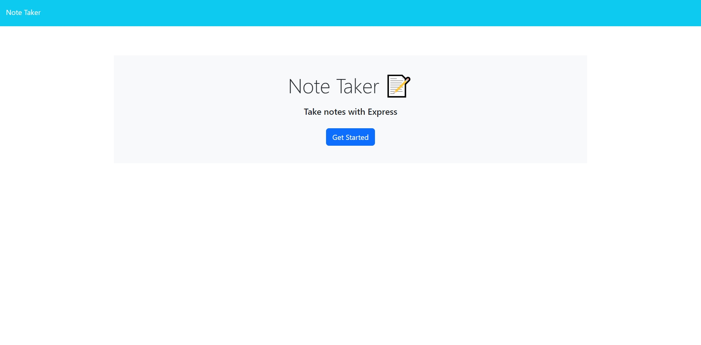
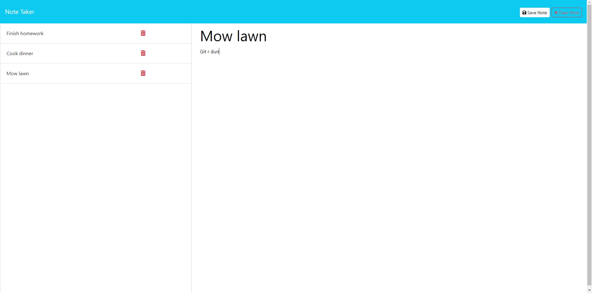

# Note Taker

## Table of Contents

- [Note Taker](#note-taker)
  - [Table of Contents](#table-of-contents)
  - [Description](#description)
  - [Technologies Used](#technologies-used)
  - [Installation](#installation)
  - [Usage](#usage)
    - [Screenshots of the Application](#screenshots-of-the-application)
  - [Credits](#credits)
  - [License](#license)

## Description

This project is a note taking application designed to take in a user's notes and store them. The app is powered by Express.js running in the backend. It uses the Node language manager with the packages File System (FS), Nodemon for debugging, and UUID for the unique ID's assigned to each note added to the list.

Working with creating GET, POST, and DELETE requests and routes allowed for more experience on the backend of applications. By using a VSCode extension Thunder Client it was possible to see the data being exchanged without the need to open the webpage itself. Using Nodemon made for quicker testing after debugging and saving the code files.

Some of the challenging issues encountered were during the implementing of the DELETE request where the `db.json` would clear the data after deleting a note entry. In the future this can be avoided by hosting the database on a server and using things such as MySQL or other methods to handle posting and deleting data.

This application is deployed using Render Dashboard.

## Technologies Used

- [Node.js](https://nodejs.org/en)
- [Express.js](https://expressjs.com/)
- [Render Dashboard](https://dashboard.render.com/)
  
## Installation

First to use this application head to the [Note Taker](https://github.com/EXCervantes/note-taker) and clone the repository. To learn how to clone a repository checkout this guide [Cloning a repository](https://docs.github.com/en/repositories/creating-and-managing-repositories/cloning-a-repository).

You must have `node` installed on your system. Go [here](https://nodejs.org/en/learn/getting-started/how-to-install-nodejs) for instructions on how to do so.

Then in the Terminal run `npm install` to install both the necessary dependencies. To initialize this application run `node index.js` in the Terminal. There click the [http://localhost:3000/](http://localhost:3000/) link to open the page in your browser.

## Usage

Being this application uses Express to initiate the server, to run the application open the Terminal or GitBash in VSCode and run `node index.js`. This will initialize the application server. Click on [http://localhost:3000/](http://localhost:3000/) to open the browser. Alternatively, users can use the Render Dashboard link to gain a more convenient way to access the application

### Screenshots of the Application

## Credits

Referenced for giving each note a unique ID

"_javascript - NodeJS, crypto.randomUUID is not a function - Stack Overflow_. (2022, August 2). Stack Overflow. Retrieved June 14, 2024, from https://stackoverflow.com/questions/73205111/nodejs-crypto-randomuuid-is-not-a-function

Referenced for deleting a note entry

  
## License

This project is licensed under 

Please see the [License](https://opensource.org/licenses/MIT) page for more info.