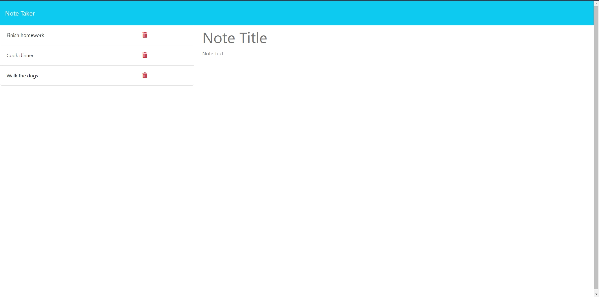

# Note Taker

## Table of Contents:

- [Note Taker](#note-taker)
  - [Table of Contents:](#table-of-contents)
  - [Description](#description)
  - [Technologies Used](#technologies-used)
  - [Installation](#installation)
  - [Usage](#usage)
    - [Screenshots of the Application](#screenshots-of-the-application)
  - [Credits](#credits)
  - [License](#license)

## Description
This project is a note taking application designed to take in a user's notes and store them. The app is powered by Express.js running in the backend. It uses the Node language manager with the packages File System (FS), Nodemon for debugging, and UUID for the unique ID's assigned to each note added to the list.

It is deployed using Render Dashboard.

## Technologies Used

- [Node.js](https://nodejs.org/en)
- [Express.js](https://expressjs.com/)
- [Render Dashboard](https://dashboard.render.com/)
  
## Installation

  
## Usage
  

### Screenshots of the Application

## Credits

Referenced for giving each note a unique ID

"_javascript - NodeJS, crypto.randomUUID is not a function - Stack Overflow_. (2022, August 2). Stack Overflow. Retrieved June 14, 2024, from https://stackoverflow.com/questions/73205111/nodejs-crypto-randomuuid-is-not-a-function

Referenced for deleting a note entry

  
## License

This project is licensed under 

Please see the [License](https://opensource.org/licenses/MIT) page for more info.